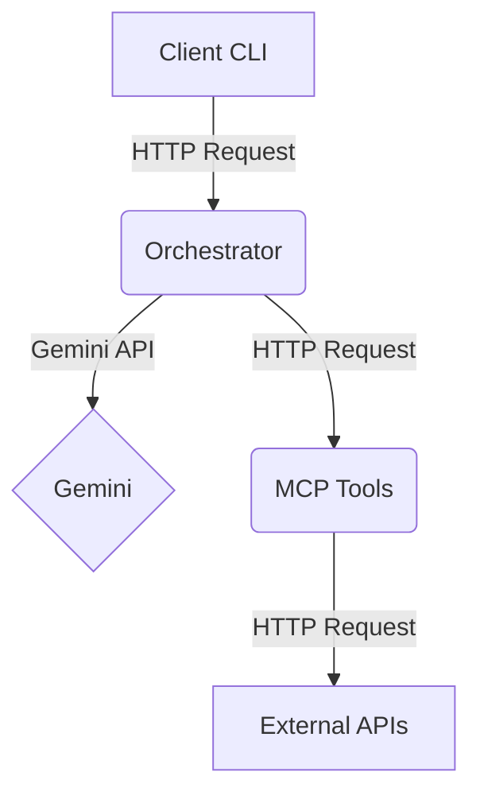

# City Day Navigator

This project is a copilot that plans a day in a city, given a time window and preferences. It checks weather and air quality, finds nearby points of interest, estimates travel times, and streams a concise plan to the user.

## Setup and Run

1.  **Clone the repository:**
    ```bash
    git clone <repository-url>
    cd <repository-directory>
    ```

2.  **Set up the environment:**
    Create a `.env` file in the root of the project and add the following environment variables:
    ```
    MCP_API_KEY=your-mcp-api-key
    GEMINI_API_KEY=your-gemini-api-key
    OPENAQ_API_KEY=your-openaq-api-key
    ```

3.  **Build and run with Docker Compose:**
    ```bash
    docker-compose up -d --build
    ```

4.  **Run the CLI:**
    ```bash
    python3 -m venv .venv
    source .venv/bin/activate
    pip install -r client_cli/requirements.txt
    python3 client_cli/main.py "Kyoto" "2025-12-12" --prefer "temples" --prefer "walkable"
    ```

## Example Prompts

*   `python3 client_cli/main.py "Amsterdam" "2025-11-22" --prefer "museums" --prefer "bike"`
*   `python3 client_cli/main.py "Kyoto" "2025-12-12" --prefer "temples" --prefer "walkable"`
*   `python3 client_cli/main.py "New York" "2025-10-31"`

## Architecture



## API Endpoints

This project uses the following external APIs:

*   **Open-Meteo** (Weather Forecast): `https://api.open-meteo.com/v1/forecast`
*   **OpenAQ** (Air Quality): `https://api.openaq.org/v3`
*   **Nominatim / OpenStreetMap** (Geocoding + Places): `https://nominatim.openstreetmap.org/search`
*   **OSRM demo** (Routing and ETAs): `https://router.project-osrm.org/route/v1/{profile}/{lon},{lat};{lon},{lat}`
*   **Nager.Date** (Public Holidays): `https://date.nager.at/api/v3/PublicHolidays/{year}/{countryCode}`
*   **exchangerate.host** (FX Rates): `https://api.exchangerate.host/latest`

## Gemini Prompt Notes

The orchestrator uses Gemini for several key tasks:

*   **Intent Classification**: The initial prompt is sent to Gemini to classify the user's intent (e.g., `plan_day`), and to extract key information like the city, date, and preferences.
*   **Venue Planning**: After gathering context from the MCP tools, the orchestrator sends a prompt to Gemini to generate a list of 4-6 venues that match the user's preferences and the current conditions (e.g., weather, air quality).
*   **Summarization**: The final prompt is sent to Gemini to generate a user-friendly Markdown itinerary. This prompt includes all the context gathered from the MCP tools, as well as instructions to handle special cases like rain, poor air quality, and public holidays. It also instructs Gemini to insert travel legs with ETAs and to add a currency conversion section if requested.
